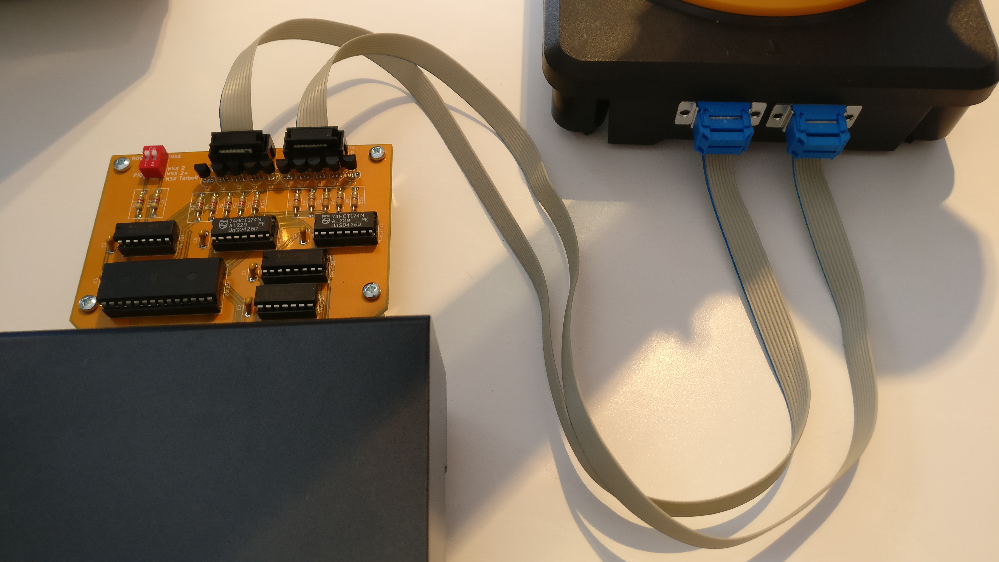

# SVI-2017

[English](README.md) - Français

La carte SVI-2017 est la recréation de la carte d'interface pour RobotArm SVI 2000.

La carte fonctionnelle en version 1.1 est compatible avec les ordinateurs MSX.

## Projet KiCad

Le projet original date de 2017.

Le dossier [KiCad](KiCad/) contient le projet migré sur KiCad 8.0.4.

L'archive originale [SVI-2017-201711091030.zip](https://github.com/patricklaf/SVI-2017/raw/main/KiCad/Gerber/SVI-2017-201711091030.zip) contient les fichiers Gerber nécessaires à la production du circuit imprimé. La fabrication a été testée avec succès par [Seeedstudio](https://www.seeedstudio.com/fusion_pcb.html).

Une [BOM interactive](https://patricklaf.github.io/SVI-2017/bom.html) est disponible pour consulter la liste des composants nécessaires et aide au montage.

Vous pouvez commander directement le PCB à partir du projet partagé sur PCBWay.

## ROM

Le fichier [ROGO.ROM](https://github.com/patricklaf/SVI-2017/raw/main/ROM/ROGO.ROM) est l'image nécessaire à la programmation de l'EEPROM de la carte.

Le fichier combine les éléments suivants :

- La ROM ROGO pour MSX.
- La ROM ROGO modifiée pour MSX 2, MSX 2+ et MSX TurboR.

## Utilisation

Le commutateur DIP de la carte permet de sélectionner le mode de fonctionnement de la carte.

Le commutateur 1 sélectionne la ROM ROGO ou le mode PIO.

Le commutateur 2 sélectionne la gamme de l'ordinateur utilisé pour activer la ROM compatible.

## ROGO

Le langage ROGO, similaire au langage Logo permet de piloter le robot en utilisant des commandes.

Un dessin du robot à l'écran reproduit les mouvements effectués.

## PIO

En mode PIO, les mouvements du robot sont réalisés en activant directement les moteurs, dans un sens ou dans un autre. Les ports 0 et 1 sont utilisés. Un mouvement est activé en positionnant à 1 le bit correspondant. Le mouvement cesse lorsque le bit est positionné à 0. 

Port 0

| Bit | Mouvement                      |
|:---:|:-------------------------------|
| 0   | Axe 2, bras en avant           |
| 1   | Axe 2, bras en arrière         |
| 2   | Axe 1, rotation vers la gauche |
| 3   | Axe 1, rotation vers la droite |
| 4   | Axe 5, fermeture de la pince   |
| 5   | Axe 5, ouverture de la pince   |

Port 1

| Bit | Mouvement                                  |
|:---:|:-------------------------------------------|
| 0   | Axe 3, bras vers le bas                    |
| 1   | Axe 3, bras vers le haut                   |
| 2   | Axe 1, rotation de la pince vers la gauche |
| 3   | Axe 1, rotation de la pince vers la droite |

> [!CAUTION]
> Il ne faut jamais activer simultanément les 2 mouvements d'un axe au risque d'endommager l'électronique de la carte. 

## Remerciements

Ce projet n'aurait pu aboutir sans l'aide indispensable des membres du site [MSX Village](https://msxvillage.fr).

Il existe un sujet dédié sur le forum du site : [Robotarm SVI le schéma](https://msxvillage.fr/forum/topic-326-1+robotarm-svi-le-schema.php).