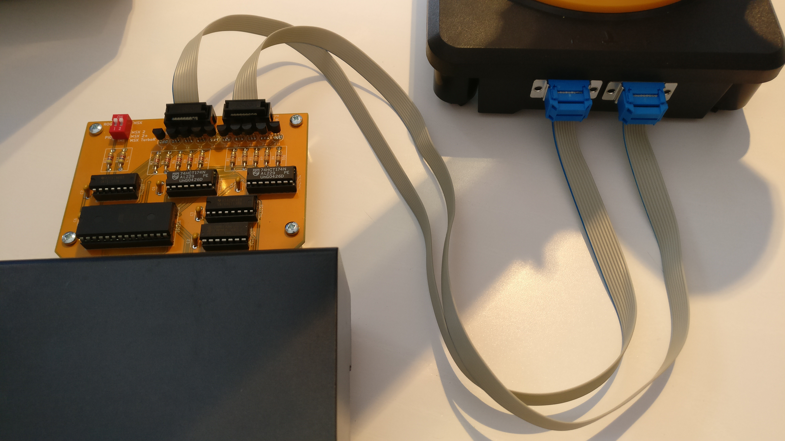

# SVI-2017

English - [Français](LISEZMOI.md)

The SVI-2017 board is the recreation of the interface board for the RobotArm SVI 2000.

The functional board in version 1.1 is compatible with MSX computers.

## KiCad Project

The original project dates from 2017.

The [KiCad](KiCad/) folder contains the project migrated to KiCad 8.0.4.

The original archive [SVI-2017-201711091030.zip](https://github.com/patricklaf/SVI-2017/raw/main/KiCad/Gerber/SVI-2017-201711091030.zip) contains the Gerber files needed to produce the PCB. The build has been successfully tested by [Seeedstudio](https://www.seeedstudio.com/fusion_pcb.html).

An [interactive BOM](https://patricklaf.github.io/SVI-2017/bom.html) is available to view the list of required components and help with assembly.

You can order PCB directly from shared project on PCBWay.

## ROM

The [ROGO.ROM](https://github.com/patricklaf/SVI-2017/raw/main/ROM/ROGO.ROM) file is the image needed to program the EEPROM of the board.

The file combines the following elements:

- The ROGO ROM for MSX.
- The modified ROGO ROM for MSX 2, MSX 2+ and MSX TurboR.

## Usage

The DIP switch on the board selects the operating mode of the board.

Switch 1 selects the ROGO ROM or PIO mode.

Switch 2 selects the model of the computer used to activate the compatible ROM.

## ROGO

The ROGO language, similar to the Logo language, allows the robot to be controlled using commands.

A drawing of the robot on the screen reproduces the movements made.

## PIO

In PIO mode, the robot's movements are made by directly activating the motors, in one direction or another. Ports 0 and 1 are used. A movement is activated by setting the corresponding bit to 1. The movement stops when the bit is set to 0.

Port 0

| Bit | Movement               |
|:---:|:-----------------------|
| 0   | Axis 2, arm forward    |
| 1   | Axis 2, arm back       |
| 2   | Axis 1, left rotation  |
| 3   | Axis 1, right rotation |
| 4   | Axis 5, clamp closing  |
| 5   | Axis 5, clamp opening  |

Port 1

| Bit | Movement                     |
|:---:|:-----------------------------|
| 0   | Axis 3, arm down             |
| 1   | Axis 3, arm up               |
| 2   | Axis 1, clamp rotation left  |
| 3   | Axis 1, clamp rotation right |

> [!CAUTION]
> Never activate the 2 movements of an axis simultaneously, otherwise you risk damaging the electronics of the card.

## Acknowledgments

This project could not have been completed without the invaluable help of the members of the [MSX Village](https://msxvillage.fr) website.

There is a dedicated topic on the site's forum: [Robotarm SVI the diagram](https://msxvillage.fr/forum/topic-326-1+robotarm-svi-le-schema.php).